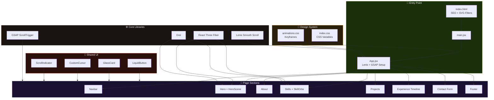
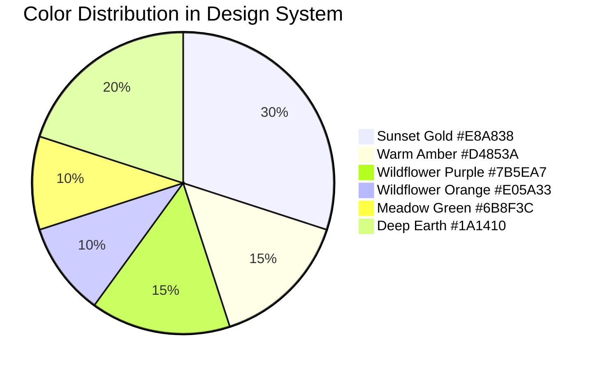
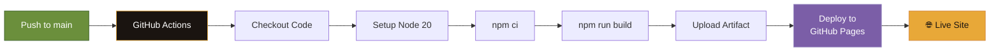
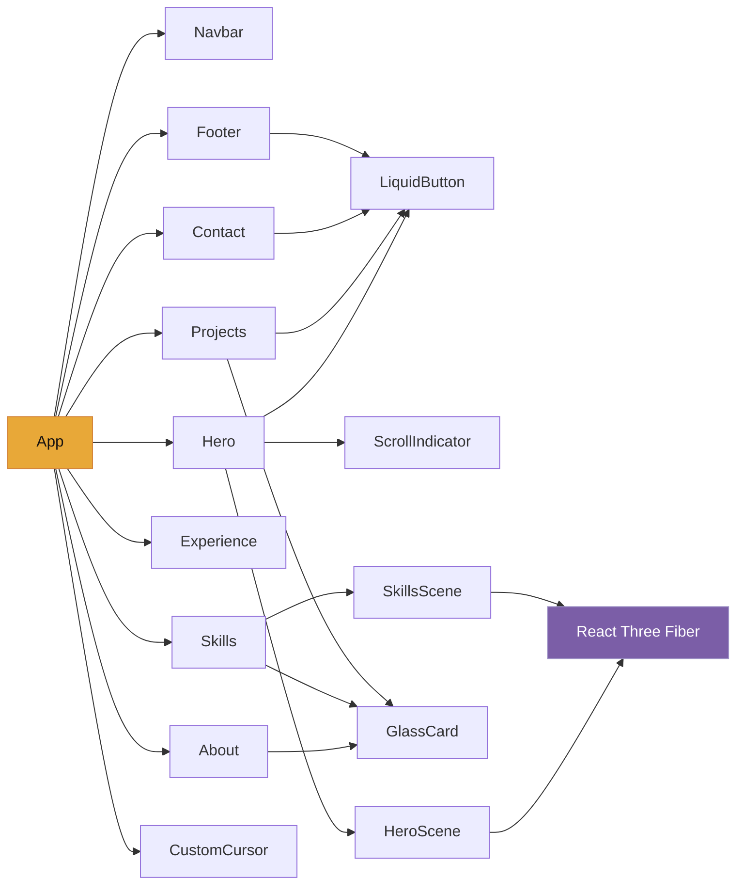

# ◈ Interactive 3D Portfolio

> A premium, interactive portfolio website featuring liquid crystal glass UI, 3D particle effects, smooth GSAP animations, and a stunning mountain-valley-inspired color palette.


---

## ✨ Features

- 🏔️ **Cinematic Hero** — Full-viewport landing with parallax background & 3D floating glass orbs
- 💎 **Liquid Crystal Buttons** — SVG turbulence filter buttons with refractive ripple hover effects
- 🎮 **3D Interactive Elements** — React Three Fiber scenes with wireframe skill orbs & particles
- ✨ **Smooth Animations** — GSAP ScrollTrigger-powered entrance animations & parallax
- 🖱️ **Custom Cursor** — Smooth-follow dot + ring cursor with hover morphing
- 🪟 **Glass Morphism** — `backdrop-filter` glass cards with 3D tilt on hover
- 📱 **Fully Responsive** — Mobile-first design with adaptive layouts
- 🚀 **Auto Deploy** — GitHub Actions CI/CD to GitHub Pages
- ⚡ **Lightning Fast** — Vite 6 build with optimized chunking

---

## 🏗️ Architecture



---

## 🎨 Color Palette



---

## 🚀 Deployment Pipeline



---

## 📂 Project Structure

```
portfolio/
├── .github/workflows/deploy.yml    # CI/CD pipeline
├── public/
│   ├── images/hero-bg.png          # Hero background
│   └── favicon.svg
├── src/
│   ├── components/
│   │   ├── Navbar/                 # Floating glass navbar
│   │   ├── Hero/                   # Landing + 3D scene
│   │   ├── About/                  # Bio + stats
│   │   ├── Skills/                 # 3D skill orbs
│   │   ├── Projects/               # Project showcase
│   │   ├── Experience/             # Timeline
│   │   ├── Contact/                # Form + socials
│   │   ├── Footer/                 # Footer
│   │   └── UI/                     # Shared components
│   ├── styles/                     # Design system
│   ├── App.jsx                     # Root component
│   └── main.jsx                    # Entry point
├── .env.example                    # Env template
├── .gitignore
├── vite.config.js
└── package.json
```

---

## 🛠️ Tech Stack

| Technology | Purpose | Version |
|-----------|---------|---------|
| **React** | UI Framework | 19.x |
| **Vite** | Build Tool | 6.x |
| **Three.js** | 3D Graphics | Latest |
| **React Three Fiber** | React ↔ Three.js | 9.x |
| **Drei** | R3F Helpers | 10.x |
| **GSAP** | Animation Engine | 3.12 |
| **Lenis** | Smooth Scrolling | 1.x |
| **GitHub Actions** | CI/CD | v4 |

---

## 🚀 Quick Start

```bash
# Clone the repository
git clone https://github.com/yourusername/portfolio.git
cd portfolio

# Install dependencies
npm install

# Start development server
npm run dev

# Build for production
npm run build

# Preview production build
npm run preview
```

---

## 📊 Component Dependency Graph



---

## 📄 License

MIT License — feel free to use this as a template for your own portfolio!

---

<p align="center">
  Built with ♡ using React, Three.js, GSAP & Vite<br/>
  <strong>◈ Portfolio</strong>
</p>
